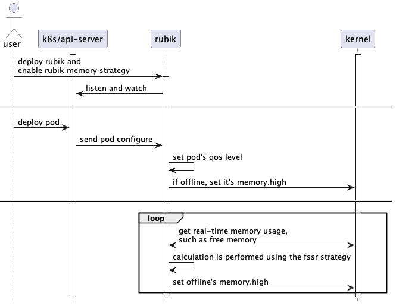
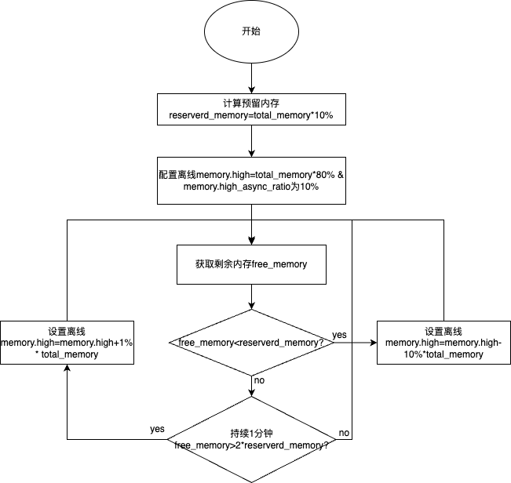

## 方案目标
在混部集群中，在线和离线业务被同时部署到同一物理资源（节点）上，同时离线业务是内存资源消耗型，在线业务有波峰波谷，在离线业务之间内存资源竞争导致在线业务受影响。该方案目标在充分利用内存资源的同时保证在线QoS。

## 总体设计
各个模块之间的联系如下：


- 用户部署rubik，rubik向k8s注册监听pod事件。
- 当离线业务被部署时k8s会通知rubik，rubik向该离线pod配置memory.high。
- 同时rubik实时监控当前节点的内存使用量，使用fssr策略向pod配置memory.high。

### 依赖说明
内核需要支持memcg级内存水位线方案，即提供`memory.high`和`memory.high_async_ratio`。

### 详细设计
内存分级方案中，rubik新增FSSR内存处理模块，该模块主要处理获取主机（节点）的总内存(total memory)、预留内存(reserved memory)、剩余内存(free memory)。并根据FSSR算法设置离线内存的memory.high。具体策略如下：

- rubik启动时计算预留内存，默认为总内存的10%，如果总内存的10%超过10G，则为10G
- 配置离线容器的cgroup级别水位线，内核提供`memory.high`和`memory.high_async_ratio`两个接口，分别配置cgroup的软上限和警戒水位线。启动rubik时默认配置`memory.high`为`total_memory`(总内存)`*`80%
- 获取剩余内存free_memory
- free_memory小于预留内存reserved_memory时降低离线的memory.high，每次降低总内存的10%,total_memory`*`10%
- 持续一分钟free_memory>2`*`reserved_memory时提高离线的memory.high，每次提升总内存的1%，total_memory`*`1%

说明：
1. 离线应用memory.high的范围为`[total_memory*30%, total_memory*80%]`

### 配置说明
```
"dynMemory": {
	"policy": "fssr"
}
```
- dynMemory表示动态内存
- policy目前只支持fssr